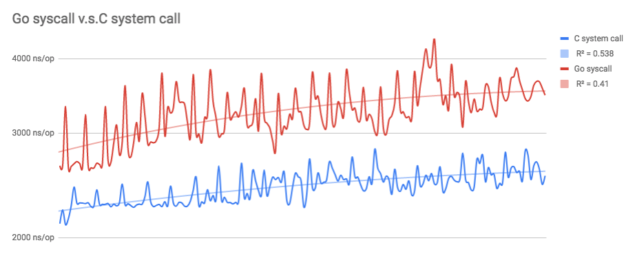

# Cgo benchmarks

This repository provides a series of benchmarks between Cgo, Go and C.

## Benchmark: CGO vs GO vs C in Empty Calls

### Results

```
goos: darwin
goarch: amd64
pkg: github.com/changkun/cgo-benchmarks/emptycall
BenchmarkEmptyCgoCalls-4        20000000                 55.9 ns/op
BenchmarkEmptyGoCalls-4         2000000000               0.29 ns/op
BenchmarkEmptyCCalls            2000000000                 00 ns/op
PASS
ok      github.com/changkun/cgo-benchmarks/emptycall    1.807s
```

### Conclusions

- Pure Go call is `(55.9 - 0.29) / 0.29 = 191.76%` faster than Cgo call.
- Pure C call is `(0.29 - 0.00) / 0.00 = infinity` faster than Go call.
- Pure C call is `(55.9 - 0.00) / 0.00 = infinity` faster than Cgo call.

### Related researches

- https://github.com/draffensperger/go-interlang

## Benchmark: CGO vs GO vs C in System Calls `read/write`



### Results

```
goos: darwin
goarch: amd64
pkg: github.com/changkun/cgo-benchmarks/syscall
BenchmarkReadWriteCgoCalls-4      500000              3532 ns/op
BenchmarkReadWriteGoCalls-4       500000              2599 ns/op
BenchmarkReadWritePureCCalls      500000              2244 ns/op
PASS
ok      github.com/changkun/cgo-benchmarks/syscall      3.142s
```

### Conclusions

- Pure Go system call is `(3532 - 2599) / 2599 = 35.90%` faster than Cgo call.
- Pure C system call is `(2599 - 2244) / 2244 = 15.82%` faster than Go system call.
- Pure C system call is `(3532 - 2244) / 2244 = 57.40%` faster than Cgo system call.

### Related researches

- https://github.com/golang/go/issues/19563
- https://github.com/golang/go/issues/19574

### Benchmark: TODO


## `go env`

```
GOARCH="amd64"
GOBIN=""
GOCACHE="/Users/changkun/Library/Caches/go-build"
GOEXE=""
GOFLAGS=""
GOHOSTARCH="amd64"
GOHOSTOS="darwin"
GOOS="darwin"
GOPATH="/Users/changkun/dev/golang"
GOPROXY=""
GORACE=""
GOROOT="/usr/local/Cellar/go/1.11/libexec"
GOTMPDIR=""
GOTOOLDIR="/usr/local/Cellar/go/1.11/libexec/pkg/tool/darwin_amd64"
GCCGO="gccgo"
CC="clang"
CXX="clang++"
CGO_ENABLED="1"
GOMOD=""
CGO_CFLAGS="-g -O2"
CGO_CPPFLAGS=""
CGO_CXXFLAGS="-g -O2"
CGO_FFLAGS="-g -O2"
CGO_LDFLAGS="-g -O2"
PKG_CONFIG="pkg-config"
GOGCCFLAGS="-fPIC -m64 -pthread -fno-caret-diagnostics -Qunused-arguments -fmessage-length=0 -fdebug-prefix-map=/var/folders/61/r39b4cjx2bggk1_p7pmpbrdw0000gn/T/go-build318232985=/tmp/go-build -gno-record-gcc-switches -fno-common"
```

## License

MIT &copy; [Changkun Ou](https://changkun.de)