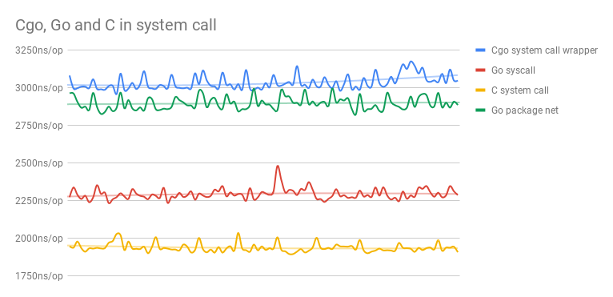

# Benchmark: CGO vs GO vs C in System Calls `read/write`

## Run

```bash
sh run.sh
```

## Results



see [data](https://docs.google.com/spreadsheets/d/1DwtZmP8fKKr3pOQWVJrD30DSOzv4_qB5KZvsd-DQ1KA/edit?usp=sharing).

```
goos: darwin
goarch: amd64
pkg: github.com/changkun/cgo-benchmarks/syscall
BenchmarkReadWriteCgoCalls-4      500000              3532 ns/op
BenchmarkReadWriteGoCalls-4       500000              2599 ns/op
BenchmarkReadWriteNetCalls-8      500000              2890 ns/op
BenchmarkReadWritePureCCalls      500000              2244 ns/op
PASS
ok      github.com/changkun/cgo-benchmarks/syscall      3.142s
```

## Conclusions

- Pure Go system call is `(3532 - 2599) / 2599 = 35.90%` faster than Cgo call.
- Pure C system call is `(2599 - 2244) / 2244 = 15.82%` faster than Go system call.
- Pure C system call is `(3532 - 2244) / 2244 = 57.40%` faster than Cgo system call.

## Related researches

- https://github.com/golang/go/issues/19563
- https://github.com/golang/go/issues/19574

## License

MIT &copy; [Changkun Ou](https://changkun.de)